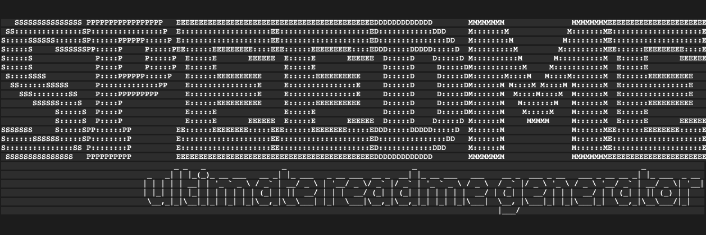
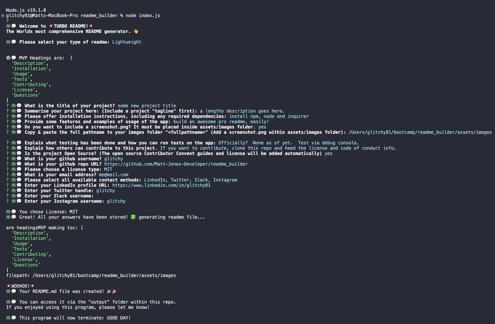

<!-- Readme top-->

[![Stargazers][stars-shield]][stars-url]
[![Issues][issues-shield]][issues-url]
[![License][license-shield]][license-url]
[![LinkedIn][linkedin-shield]][linkedin-url]

	

 

# SPEEDME Ultimate README Generator

<h3>"SPEEDME THAT README!"</h3>
<a href="https://github.com/Matt-Jones-Developer/speedme_ultimate_readme_generator/"><strong>Explore the docs »</strong></a>
 
 
<a href="https://github.com/Matt-Jones-Developer/speedme_ultimate_readme_generator/">View Project</a>
·
<a href="https://github.com/Matt-Jones-Developer/speedme_ultimate_readme_generator/issues">Report Bug</a>
·
<a href="https://github.com/Matt-Jones-Developer/speedme_ultimate_readme_generator/issues">Request Feature</a>
·
<a href="https://github.com/matt-jones-developer?tab=repositories">Check out my work</a>
·

 

## Table of Contents

* [Description](#description)
* [Installation](#installation)
* [Usage](#usage)
* [Tests](#tests)
* [Contributing](#contributing)
* [License](#license)
* [Questions](#questions)
#

## Project Summary

SPEEDME is the ultimate README.md generator.  Load up the CLI program, ask a few questions and let it generate a professional looking readme in no time. Featuring both Lightweight and Professional modes, you can select the level of detail you want to have.

### Motivation
To make an advanced auto generating readme.  Using markdown and HTML, I wanted to make sure it was as good as my other readme files.

### Challenges
Many.  I made it too complicated initially before making MVP and had to back track quite a bit.  I had grand visions of modularising my scripts, which was working well until I had too many other commitments so I had to stick with the original single script version. I asked 2 TA's about my pro version code and they said they couldn't fault it.  I guess it's just one of those bugs.  I still have the 'Professional' version  in the pipeline, so will be updating this once the bug is fixed.  Lessons learned!

### Unique Selling Points
I think it's an attractive, enjoyable program that produces a great looking, very professional readme.  The emoji's make it cuter and the actual content generated is pretty close to my current default readme's - the professional mode offers way more control over which headings you want and way more screenshots, UI design wireframe shots and more. 

#

(<a href="#readme-top">back to top</a>)

## Installation

To install and use this CLI program you must first head to your terminal:  type 'npm install' to download the latest version of NPM.  Next, you'll need want to initialise npm: 'npm init -y' or without -y if you want to specify you're own settings.  Next up is node.js.  Install by typing 'npm install node' - you'll want to use version 19.1 on an M1 Macbook though; I ran into issues with 19.6.  Finally install dependencies: npm i inquirer.  Lastly you can run the program by going to the root folder and typing 'node index.js' - if you run into issues you'll need to check npm and check npm ls to make sure you have all the correct dependencies!

## Usage

- create a pro readme in minutes - no need to worry about formatting, the auto capitalise function takes care of that - add all images including header, logo and screenshots to ..assets/images.  Done! Here is a screenshot of the program running. The pro version will have multiple screenshots its a WIP.

## Tests

If you want to test the app you could run the debugger via vscode - we havent covered official unit testing yet so I cannot really provide much info here.

## Contributing

The project IS open source.  Feel free to clone and re-use or improve it, but please do respect the rules of my license and accredit your readme with my name and github username/url.

(<a href="#readme-top">back to top</a>)

## SPEEDME Ultimate README generator is an Open Source Project:

### Code of Conduct:
Learn more about open source code of conduct:
[Contributor Covenant](https://www.contributor-covenant.org/)

Read the full code of conduct here:
[English (HTML version)](https://www.contributor-covenant.org/version/2/1/code_of_conduct/)

### Attribution
Contributor Covenant is included in this open source project.  Read the [license.](https://github.com/EthicalSource/contributor_covenant/blob/release/LICENSE.md)
;

#
## License

This project is licensed under the terms of the Apache 2.0 license.

For more information, please visit this link: [Apache 2.0](https://choosealicense.com/licenses/apache-2.0/)

#
## Questions

For questions or concerns, please contact [matt-jones-developer](https://github.com/Matt-Jones-Developer/speedme_ultimate_readme_generator) via Github.
###  Other contacts:

You can also reach me via the following: 👻💬

📪 [Email](me@.com) · [LinkedIn](www.linkedin.com/in/matt-jones-zx81) · [Twitter](glitchy) · [Slack](matt jones) · [Instagram](glitchy81) 

[stars-shield]: https://img.shields.io/github/stars/matt-jones-developer/speedme_ultimate_readme_generator.svg?style=for-the-badge
[stars-url]: https://github.com/Matt-Jones-Developer/speedme_ultimate_readme_generator/stargazer
[issues-shield]: https://img.shields.io/github/issues/matt-jones-developer/speedme_ultimate_readme_generator.svg?style=for-the-badge
[issues-url]: https://github.com/Matt-Jones-Developer/speedme_ultimate_readme_generator/issues
[license-shield]: https://img.shields.io/badge/License-Apache%202.0-orange.svg
[license-url]: https://choosealicense.com/licenses/apache-2.0/
[linkedin-shield]: https://img.shields.io/badge/-LinkedIn-black.svg?style=for-the-badge&logo=linkedin&colorB=555
[linkedin-url]: www.linkedin.com/in/matt-jones-zx81

(<a href="#readme-top">back to top</a>)

## Deployment & Repo links:

Project Repo Link: [https://github.com/Matt-Jones-Developer/speedme_ultimate_readme_generator](https://github.com/Matt-Jones-Developer/speedme_ultimate_readme_generator)

Deployed Project Link: [https://github.com/Matt-Jones-Developer/speedme_ultimate_readme_generator](https://matt-jones-developer.github.io/speedme_ultimate_readme_generator/)

